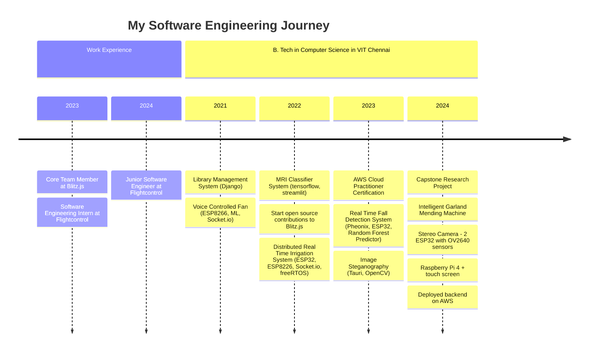
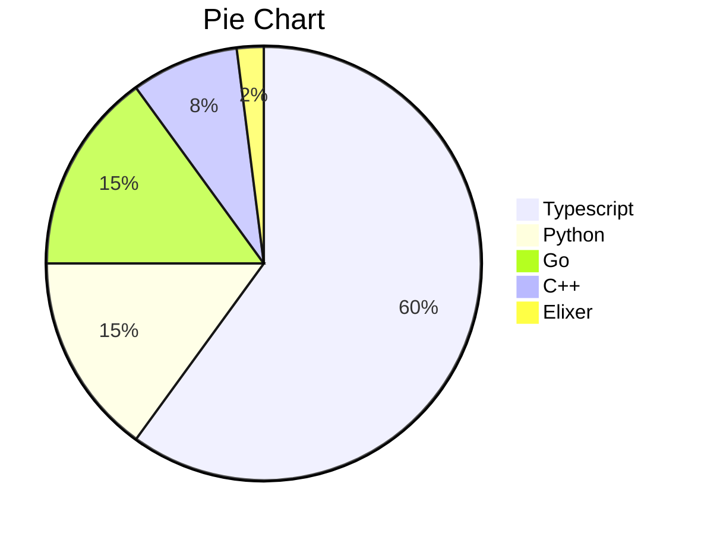

# 👋 Hey, I’m Siddharth Suresh

[](https://github.com/LordDashMe/github-contribution-stats/)

## 🚀 About Me

B.Tech in Computer Science with a Specialization in Cyber Physcical Systems from Vellore Institute of Technolody, Chennai Campus

I am a self taught full stack developer, an open-source contributer and enthusiastic about learning and experimenting with latest technologies.



## 🛠 Skillset



 <!-- ```mermaid
mindmap
  root((Domain))
    Open Source
        ((Blitz.js))
    Backend
        Long history
        Popularisation
        British popular psychology author Tony Buzan
    Frontend
        On effectiveness<br/>and features
        On Automatic creation
        Uses
            Creative techniques
            Strategic planning
            Argument mapping
    CLI
        Pen and paper
        Mermaid
    id)DevOps(
        Pen and paper
        Mermaid
``` -->

## ✉️ Contact Me

[Send Me an Email - siddharth@siddharthsuresh.dev](mailto:siddharth@siddharthsuresh.dev)

## 🔗 Links
[](https://siddharthsuresh.me/)
[](https://www.linkedin.com/in/siddharth-sureshn/)
<!-- [](https://twitter.com/_siddhsuresh) -->
[](https://codepen.io/siddhsuresh)

